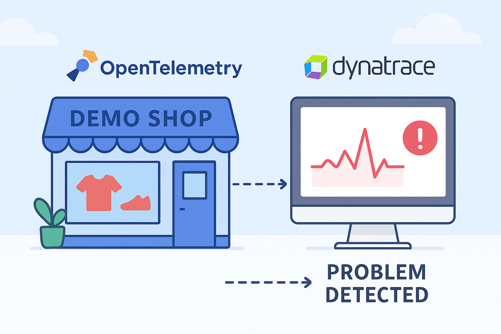

<!-- markdownlint-disable-next-line -->
#  Demo AstronomyShop Problem triggering and detection in Dynatrace 

___

This is a sample repository for spining up the Astroshop and triggering problems.

## [👨‍🏫 Learn how to trigger problems for the Astroshop and visuallize them in Dynatrace!](https://dynatrace-wwse.github.io/demo-astroshop-problems)

