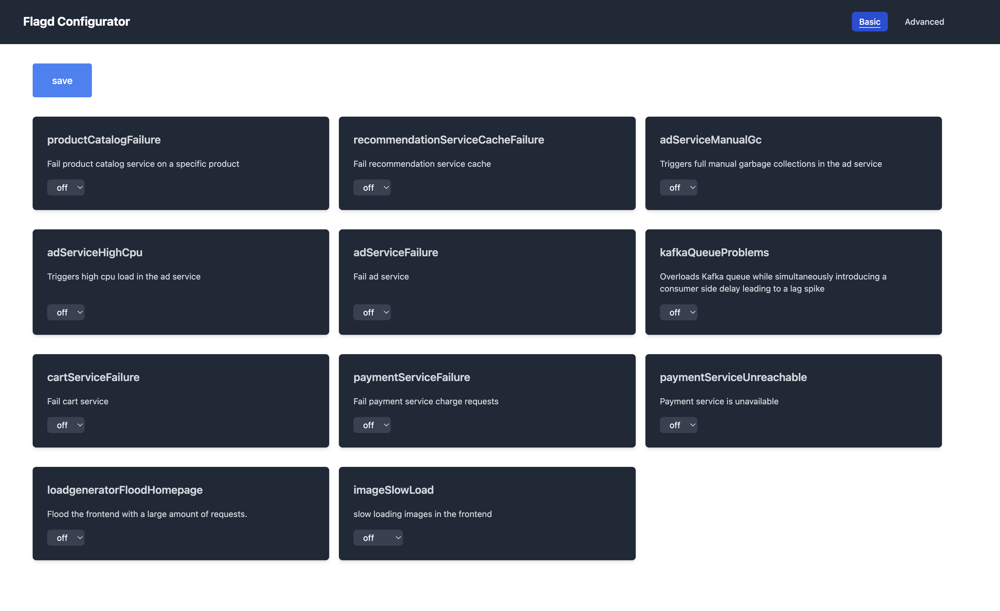

--8<-- "snippets/4-content.js"

## Accessing the Astroshop

### in Kubernetes

### in the UI

## Triggering Problems

### Manually via UI

Go to the codespaces exposed port, since the astroshop is the first app deployed, the assigned port is 30100. THe url for the features flag should look something like [http://localhost:30100/feature](http://localhost:30100/feature)

### Manually via REST API

### Scheduling Problems

- [Let's continue:octicons-arrow-right-24:](cleanup.md)

