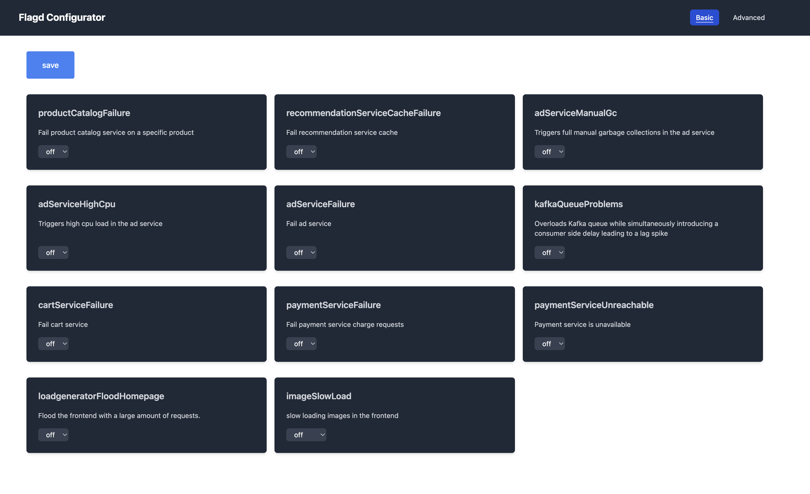

--8<-- "snippets/4-content.js"

# Workshop content

## Bringing the workshop up

`post-create` only sets up the dev tooling + k3d cluster. The
workshop itself is one extra call (opt-in to keep the CI integration
test fast):

```bash
bootstrapWorkshop
```

That runs, in order:

| Phase | What | How long |
|---|---|---|
| `deployApp astroshop` | 15+ Astroshop pods in the `astroshop` namespace | 3–5 min |
| `installGitlab` | gitlab/gitlab helm chart in `gitlab` ns, ingress at `gitlab.<ip>.sslip.io` | ~6 min |
| `seedGitlabRepos` | push 19 `Otel-App/*` + 3 `Support/*` repos to the in-cluster GitLab | ~30 sec |
| `installDtctl` + `installMonaco` | platform CLIs under `~/.local/bin/` | <10 sec |
| `applyMonacoConfig` | SRG + workflows + dashboards + 120+ tagging/span/request configs to your Dynatrace tenant | 1–2 min |
| `deployLoadgenerator` | locust + Playwright in `astroshop-load` ns, hitting the Astroshop frontend continuously | ~30 sec |

`printGreeting` shows the URLs for each component.

Tokens for the monaco / event ingest steps live in
`.devcontainer/.env` (gitignored, mode 0600) — see
[the monaco config doc](monaco-config.md#required-env-vars).

## Accessing the Astroshop

Run `printGreeting` in the terminal — it lists the public URL on
`sslip.io`. In Codespaces it's `https://<codespace>-80.app.github.dev/`.

## Flipping the release / problem variant

The four release variants live on dedicated branches in the seeded
GitLab repos (`main`, `usecase/cpu`, `usecase/memory`, `usecase/n+1`,
`usecase/error`).

### Manual flip from the dev container

```bash
# Send the deployment event + SDLC pipeline event to Dynatrace
sendDeploymentEvent 1.12.1 staging cpu
```

### Manual flip via the Astroshop UI

The Astroshop also exposes its own feature-flag UI — open the URL from
the greeting and append `/feature`. In Codespaces this is something like
`https://<codespace>-80.app.github.dev/feature`.



### Hourly auto-flip via the GitLab pipeline

The seeded `Support/Astroshop_Automated_Load_test` repo
(`.gitlab-ci.yml`) walks the four releases on a schedule, triggering
the per-service pipelines in `Otel-App/*` and emitting Workflow runs
+ CUSTOM_DEPLOYMENT events at each stage — perfect for the unattended
"let it run while we talk" demo.

### Full demo data in seconds (no pipeline run needed)

For a meeting where you can't wait for the GitLab pipeline to actually
walk through, the bash helper `seedWorkshopReleases` posts the
complete event sequence — 4 deployments + 4 pipeline runs + 24 task
events + 4 SRG verdicts (1 pass + 3 fail) — directly to your tenant:

```bash
set -a; source .devcontainer/.env; set +a
source .devcontainer/util/source_framework.sh
seedWorkshopReleases
```

## Stop bad builds — the integrated demo

This is the meat of the workshop. See [Stop bad builds](stop-bad-builds.md)
for the full narrative; the short version:

1. The GitLab pipeline deploys `1.12.0` to staging → CUSTOM_DEPLOYMENT
   event fires from `Otel-App/<service>/.gitlab-ci.yml`.
2. Locust hammers the shop while OneAgent records traces + Golden
   Signals. The load test step names (`01 - homepage`, `02 - get
   products`, …) come through as request attributes.
3. The SRG `Astroshop - Staging - Quality gate` (in monaco at
   `init_configs/labs/srg-staging.json`) evaluates 11 test-step
   latency objectives over the load-test window → PASS.
4. Pipeline promotes to production.
5. Repeat with `1.12.1`/cpu — SRG returns FAIL → pipeline **halts**
   before the `promote-production` job. The SRG workflow opens a
   GitLab issue via the **Dynatrace GitLab Connector**.

## CI/CD Observability — the Dynatrace app

This repo is wired to feed the
[community **CI/CD Observability** app](https://github.com/Dynatrace/community-examples/tree/main/dynatrace%20apps/CI-CD%20Pipeline).
The app is "available upon request" — your Dynatrace contact activates
it on your tenant, then the data path is:

```
GitHub Action / bash helper
    │  (POST)
    ▼
/platform/ingest/custom/events.sdlc/<provider>     ←  OpenPipeline rules
    │                                                 in the app translate
    ▼                                                 these to SDLC events
Grail (events table, kind=SDLC_EVENT)
    │
    ▼
CI/CD Observability app dashboards / flamegraph
```

Two bash helpers in `.devcontainer/util/my_functions.sh`:

* **`seedWorkshopReleases`** — full end-to-end demo for the GitLab
  pipeline: each of the 4 release variants fires
  `CUSTOM_DEPLOYMENT` + pipeline-run SDLC + 6 task events +
  guardian-verdict bizevent. `1.12.0` passes; `1.12.1/2/3` fail.
* **`seedCicdPipelineData`** — pipeline + task events only (no
  deployment + no verdict). Use when only the CI/CD Observability app
  matters.

```bash
# tokens + URL are in .devcontainer/.env (gitignored, 0600)
set -a; source .devcontainer/.env; set +a
seedWorkshopReleases
```

Required scopes on `DT_API_TOKEN`: `events.ingest` and
`openpipeline.events_sdlc.custom`.

## Resources cap & cleanup

The four broken-release pipelines deliberately stress the cluster. If a
codespace runs out of file descriptors:

```bash
sudo sysctl -w fs.inotify.max_user_watches=524288
sudo sysctl -w fs.inotify.max_user_instances=512
sudo sysctl -w fs.inotify.max_queued_events=16384
```

<div class="grid cards" markdown>
- [Stop bad builds :octicons-arrow-right-24:](stop-bad-builds.md)
- [Open questions Q&A :octicons-arrow-right-24:](cicd-observability.md)
- [Cleanup :octicons-arrow-right-24:](cleanup.md)
</div>
